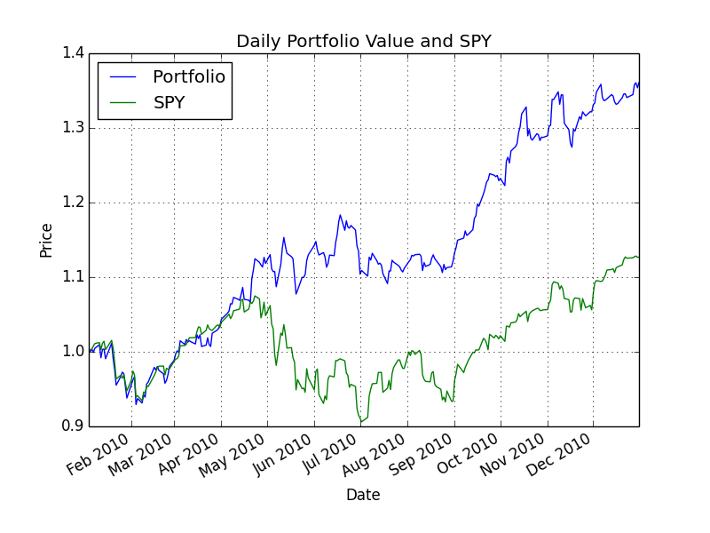
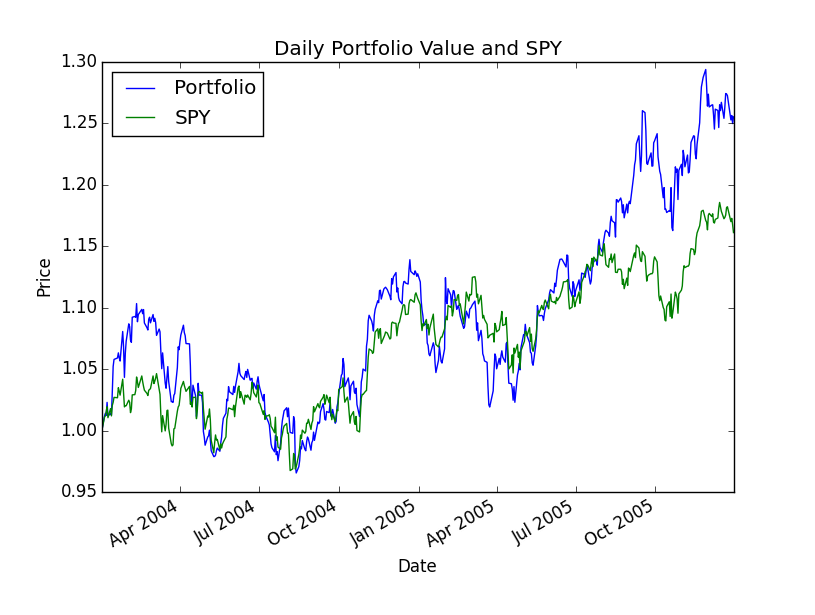

# MC 1 Project 2
## Overview
In this project you will use what you learned about optimizers to optimize a portfolio. That means that you will find how much of a portfolio's funds should be allocated to each stock so as to optimize it's performance. In this case we define "optimal" as maximum Sharpe ratio.

You will leverage the functions you created in the last project that assessed the value of a portfolio with a given set of allocations.

## Task
Implement a Python function named optimize_portfolio() in the file optimization.py that can find the optimal allocations for a given set of stocks. You should optimize for Sharpe ratio (i.e., maximize Sharpe ratio).

The function should accept as input a list of symbols as well as start and end dates and return a list of floats (as a one-dimensional numpy array) that represents the allocations to each of the equities. You should take advantage of routines developed in the portfolio analysis project to compute daily portfolio value and statistics. You should cut-and-paste your code for the functions that did this from the last project into optimization.py.

You are given the following inputs for optimizing a portfolio:

  - A date range to select the historical data to use (specified by a start and end date)
  - Symbols for equities (e.g., GOOG, AAPL, GLD, XOM). Note: You should support any symbol in the data directory.
  
Your goal is to find allocations to the symbols that maximize Sharpe ratio. Assume 252 trading days in a year and a risk free return of 0.0 per day. You should implement the following API EXACTLY, if you do not your submission will be penalized.

```python
import datetime as dt
allocs, cr, adr, sddr, sr = \
    optimize_portfolio(sd=dt.datetime(2008,1,1), ed=dt.datetime(2009,1,1), \
    syms=['GOOG','AAPL','GLD','XOM'], gen_plot=False)
```

Where the returned output is:

allocs: A 1-d Numpy ndarray of allocations to the stocks. All the allocations must be between 0.0 and 1.0 and they must sum to 1.0.
  - cr: Cumulative return
  - adr: Average daily return
  - sddr: Standard deviation of daily return
  - sr: Sharpe ratio

The input parameters are:

  - sd: A datetime object that represents the start date
  - ed: A datetime object that represents the end date
  - syms: A list of symbols that make up the portfolio (note that your code should support any symbol in the data directory)
  - gen_plot: If True, create a plot named plot.png

ALL of your code should be present in the single file optimization.py

## Template

Instructions:

  - Ensure your directory structure has been properly checked out from github.
  - Implement the optimize_portfolio() function in mc1_p2/optimization.py.
  - To execute, run python optimization.py from the mc1_p2/ directory.

Your solution to the optimization problem should leverage the software you developed in the last assignment. However you cannot call your old file analysis.py, you must copy and paste that old code into the single file for this assignment. To test your code, we will be calling optimize_portfolio() only. Make sure the output and plot look like the examples shown below.

## Suggestions

Refer to comments in the provided helper code for pointers regarding how to implement it. In order to specify bounds and constraints when using the scipy.optmize module, you'll need to use a special syntax explained here: http://docs.scipy.org/doc/scipy/reference/generated/scipy.optimize.minimize.html

For bounds, you simply need to pass in a sequence of 2-tuples (<low>, <high>). Just remember that you need to supply as many tuples as the number of stocks in your portfolio.

For constraints, it's a little tricky. You need to pass in a sequence of dicts (dictionaries), one dictionary per constraint. Each dictionary must specify the type of constraint ('eq' for equality, or 'ineq' for inequality), and a function that returns 0 only when the input satisfies the constraint (this is the same input that is supplied to your evaluation function). E.g. to constrain the sum of all values in the input array to be less than 50, you could pass in the following (lambdas are just anonymous functions defined on-the-spot):

```python
constraints = ({ 'type': 'eq', 'fun': lambda inputs: 50.0 - np.sum(inputs) })
```

## Example output 1
Here's an example output for your function. These are actual correct values that you can use to check your work.

```python
Start Date: 2010-01-01
End Date: 2010-12-31
Symbols: ['GOOG', 'AAPL', 'GLD', 'XOM']
Optimal allocations: [  5.38105153e-16   3.96661695e-01   6.03338305e-01  -5.42000166e-17]
Sharpe Ratio: 2.00401501102
Volatility (stdev of daily returns): 0.0101163831312
Average Daily Return: 0.00127710312803
Cumulative Return: 0.360090826885
```



## Example output 2
```python
Start Date: 2004-01-01
End Date: 2006-01-01
Symbols: ['AXP', 'HPQ', 'IBM', 'HNZ']
Optimal allocations: [  7.75113042e-01   2.24886958e-01  -1.18394877e-16  -7.75204553e-17]
Sharpe Ratio: 0.842697383626
Volatility (stdev of daily returns): 0.0093236393828
Average Daily Return: 0.000494944887734
Cumulative Return: 0.255021425162
```


